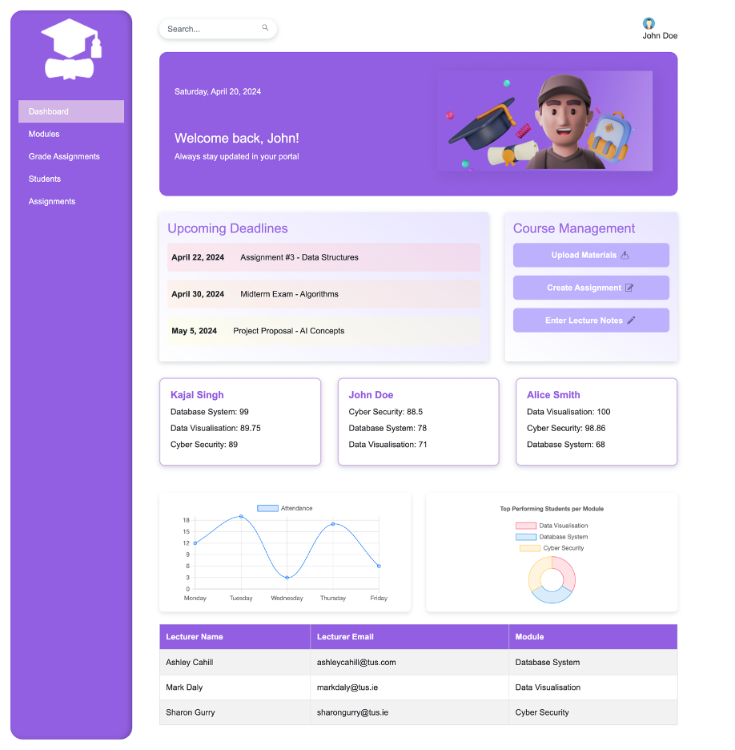
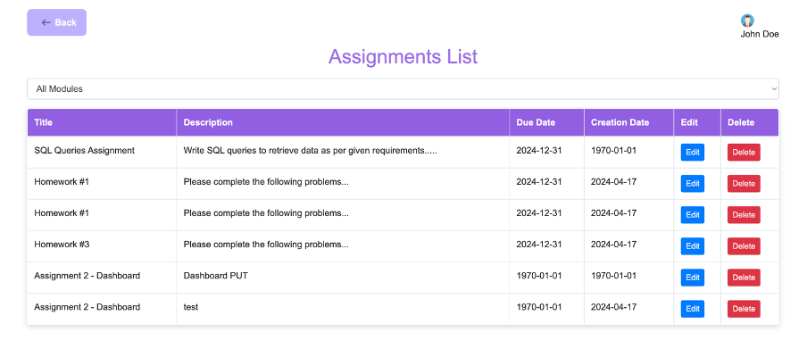
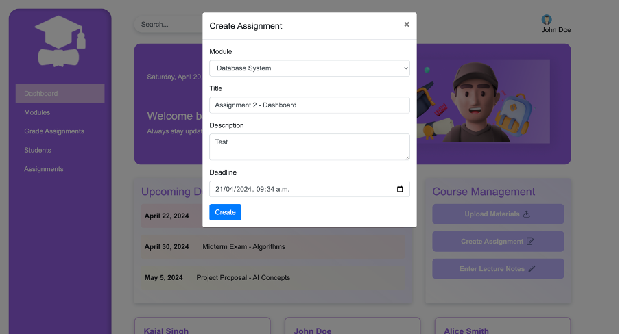
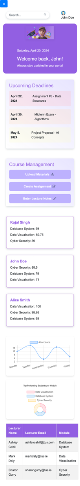
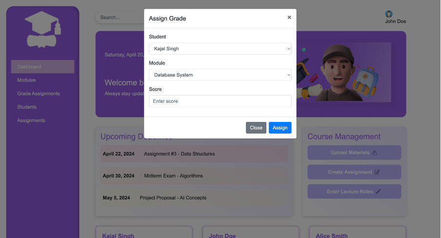
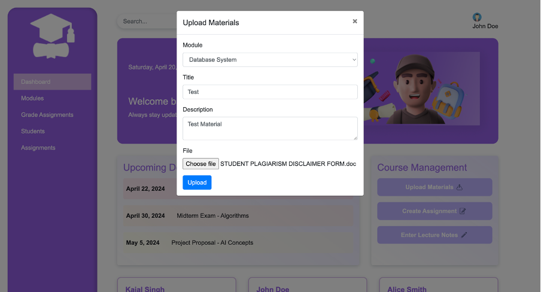

# Educational Portal System

This educational portal is a full-stack web application designed to facilitate interaction between lecturers and students, streamline the management of course materials, assignments, and grading.

## Project Overview

The portal features a user-friendly interface, dynamic content updates, and a robust backend for managing educational data. 

## Technical Stack

- **Frontend**: HTML5, CSS3 with Bootstrap 4.5.2 for responsive design, JavaScript for interactivity, Chart.js for data visualization, Moment.js for date handling, and jQuery for AJAX calls.
- **Backend**: Node.js with Express for the server-side logic, MySQL for the database, and npm for managing dependencies.

## Key Features and Functionalities

- **Dashboard**: Offers an overview of upcoming deadlines, course management, and analytics on student performance.
- **Assignment Management**: Provides features to create, edit, and delete assignments.
- **Material Management**: Supports the uploading and management of course-related materials.
- **Grade Management**: Includes a system for assigning and recording student grades.
- **Responsive Design**: Ensures the portal is accessible across a range of devices.
- **API Integration**: Uses AJAX for asynchronous operations, fetching, posting, and managing data related to courses.

## Prerequisites

Before you begin, ensure you have met the following requirements:
- Node.js (v12.x or higher)
- npm (v6.x or higher)
- MySQL (v5.7 or higher)

## Installation

To install the Educational Portal System, follow these steps:

Linux and macOS:

```bash
git clone https://github.com/kajal1106/Educational-Portal-System
cd educational-portal
npm install
```
## Running the Project

1. **Database Setup**:
   - Use the `schema.sql` file within the `db` directory to set up your MySQL database.
   - Update the `dbConfig.js` with your database credentials.

2. **Install Dependencies**:
   - Run `npm install` to install all necessary node modules.

3. **Start the Backend Server**:
   - Execute `node server.js` to start your Node.js server.

4. **Accessing the Frontend**:
   - Navigate to `http://localhost:<your-configured-port>` in your web browser to view the portal.

## UI Components

- **Navigation Sidebar**: Facilitates access to different sections like assignments, students, and materials.
- **Dynamic Tables**: Display assignments and grades, with functionalities for edit and delete.
- **Interactive Charts**: Visualize attendance and grading statistics.

## Backend Services

- **RESTful API**: Node.js/Express backend handles API requests for CRUD operations.
- **MySQL Database**: Stores all user data, assignments, materials, and grades.

## Folder Structure

```
project-root/
│
├── config
│ └── dbConfig.js # Database configuration
├── controllers # Backend logic
├── db
│ └── schema.sql # Database schema
├── public # Frontend assets
│ ├── css
│ │ └── styles.css # Stylesheet
│ ├── img # Images directory
│ └── js
│ └── script.js # Frontend JavaScript
├── routes
│ └── apiRoutes.js # API routes
├── views # HTML files
│ ├── assignments.html # Assignment list view
│ └── main.html # Main layout file
├── .gitattributes # Git configuration file
├── package.json # Project metadata and dependencies
├── package-lock.json # Locked versions of dependencies
├── README.md # Project documentation
└── server.js # Entry point for the Node.js server
```

## How to Use
- **Modals**: Actions like grade assignment, upload materials, and create assignments are handled through modals for a seamless user experience.

## Screengrabs

Here are some screengrabs of the Educational Portal System:

### Dashboard


### Assignment List


### Create Assignment Modal


### Dashboard on Mobile


### Grade Assignment Modal


### Upload Material Modal



## Conclusion
This project integrates a robust backend with a sleek frontend, providing all the necessary tools for educational management in one convenient platform.

## Contributing

We welcome contributions to the Educational Portal System. To contribute:

1. Fork the repository.
2. Create a new branch (`git checkout -b feature/AmazingFeature`).
3. Commit your changes (`git commit -m 'Add some AmazingFeature'`).
4. Push to the branch (`git push origin feature/AmazingFeature`).
5. Open a pull request.


## Support

For support, email singh.kajal940@gmail.com.

## Acknowledgements

- [Bootstrap](https://getbootstrap.com)
- [jQuery](https://jquery.com)
- [Chart.js](https://www.chartjs.org)
- [Moment.js](https://momentjs.com)


